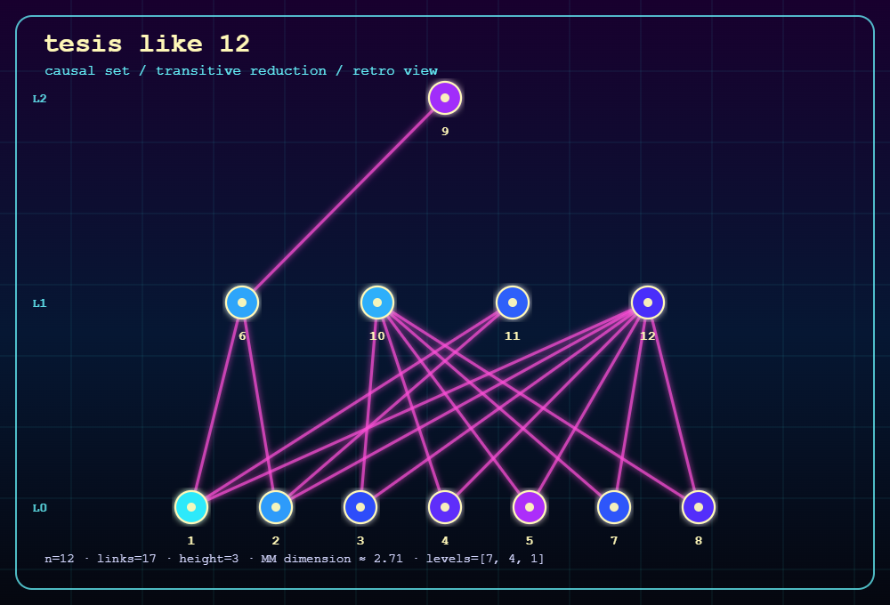

# Thirty-Nine Years of Simulated Annealing on a Causal Set

*A revival of Bombelli (1987) with 2026 tools*

*Jose Ignacio Martin Gandul · 2026*

[](https://doi.org/10.5281/zenodo.20357739)
[](https://opensource.org/licenses/MIT)
[](https://www.python.org/downloads/release/python-3120/)

Project landing page: <https://nacho09021973.github.io/bombelli/>

---



---

> *"An application of simulated annealing"*
> — Title of Appendix A.2, Luca Bombelli's PhD thesis, 1987

> *"¿Para qué llamar caminos*  
> *a los surcos del azar?"*  
> — Antonio Machado

---

## What this is

A modern Python revival and empirical audit of Luca Bombelli's 1987 causal-set simulated annealing program.

In 1987, Luca Bombelli appended to his PhD thesis a Pascal program that tried to embed small causal sets into Minkowski spacetime by simulated annealing. The program ran on the workstations of the era, produced results for a handful of cases, and was never published as a standalone tool.

This repository provides a faithful Python 3.12 port of Bombelli's Pascal simulated-annealing program for embedding causal sets into Minkowski spacetime. It includes reproducible CPU experiments, ensemble statistics, order-theoretic diagnostics, benchmark tables, and documentation of the historical and computational context. The work revisits an early causal set algorithm using modern software engineering, reproducibility practices, and AI-assisted code archaeology.

It is written for curious readers, physics enthusiasts, and people who enjoy computational archaeology. It does not claim to advance causal set theory; it is simply a closer look at one old algorithm.

The paper is in [`paper/bombelli_revival_2026.md`](paper/bombelli_revival_2026.md).

Questions, corrections, replication notes, and citation requests are welcome through
the public issue tracker: <https://github.com/nacho09021973/bombelli/issues>.

---

## What is in this folder

```
Bombelli/
├── cones.py                  # Faithful Python 3.12 port of Bombelli's Pascal annealer
├── causet_invariants.py      # Order-theoretic invariants (chains, links, height, MM dim)
├── validation_suite.py       # Sprinkler, controls, Lorentz-invariant residual, recovery
├── visualize_causets.py      # Retro SVG diagrams for small causal sets
├── experiments.py            # Reproducible driver: regenerates every data/*.csv
├── Makefile                  # make test / smoke / data
│
├── tests/                    # Real unit tests (RNG, energy oracle, invariants)
│
├── inputs/
│   ├── tesis_like_6.in       # 6-element causal set (fast benchmark)
│   └── tesis_like_12.in      # 12-element causal set (Bombelli's canonical case)
│
├── data/
│   ├── schedule_comparison.csv   # Bombelli defaults vs tuned schedule (Section III)
│   ├── warmup_comparison.csv     # Legacy / skip / guarded warmup (Section IV)
│   ├── dimension_atlas.csv       # Dimension estimators on manifoldlike and controls (Section V)
│   └── correlate_summary.csv     # Top order-theoretic correlates (Section VI)
│
├── paper/
│   └── bombelli_revival_2026.md  # The full comparison document
│
└── references/
    ├── Pascal.pdf                # Bombelli's original Pascal source (thesis appendix)
    └── Bombelli_1987_PhD.pdf     # Bombelli's PhD thesis, Syracuse University
```

---

## The one-minute version

**What Bombelli had in 1987:**
A Pascal program, a single workstation, and one run per case.

**What we have in 2026:**
The same program ported to portable Python, plus the ability to run many seeds across a parameter grid on ordinary CPU machines.

**What changed in one test:**
On the 12-element benchmark, the default schedule (T₀ = 100, α = 0.9) gives a mean final energy of 22.735 across 100 seeds and never reaches a faithful embedding. With T₀ = 180 and α = 0.8 — same algorithm, same energy function, same move set — the optimizer reaches zero energy in 95 of 100 seeds. This is not a new theory; it is just the kind of parameter sensitivity that becomes easier to see when repeated runs are cheap.

---

## The five findings

### I. The schedule matters

| Schedule | T₀ | α | Mean final energy (100 seeds) | Zero-energy runs |
|:---|---:|---:|---:|---:|
| Bombelli defaults | 100 | 0.9 | 22.735 | 0 / 100 |
| Tuned (grid scan) | 180 | 0.8 | 0.000 | 95 / 100 |

Source: [`data/schedule_comparison.csv`](data/schedule_comparison.csv) — regenerate with `python experiments.py schedule` (run at `dim = 3`, seeds 1959–2058).

### II. The warmup can disturb near-perfect initializations

Before annealing the program runs an unconditional-accept warmup loop. What that warmup does to controlled initializations (measured in isolation, no subsequent anneal; "preserved" means final energy below 1.0):

| Initialization | Legacy warmup | Skip warmup | Guarded warmup |
|:---|:---|:---|:---|
| Ground truth (E = 0) | Preserved 18/18 | Preserved 18/18 | Preserved 18/18 |
| Truth + small noise (ε = 10⁻³) | Mean E = 111.7, 16/18 | Mean E = 0.003, 18/18 | Mean E = 0.000, 18/18 |
| Truth + medium noise (ε = 5×10⁻²) | Mean E = 747.1, 0/18 | Mean E = 6.79, 1/18 | Mean E = 6.02, 5/18 |
| Random initialization | Mean E = 875.0, 0/18 | Mean E = 451.7, 0/18 | Mean E = 239.8, 0/18 |

*Grid: d ∈ {2, 3, 4}, n ∈ {32, 64}, seeds 1959/1962/1987 — 18 cells per row.*

The guarded warmup accepts a proposed move only if it does not increase the energy. It is an external wrapper around the same internals — no change to the energy, the move set, or the cooling schedule. Because the Bombelli move size at a node is proportional to that node's local energy, a faithful configuration is a fixed point of every mode, which is why the ground-truth row is preserved everywhere.

Source: [`data/warmup_comparison.csv`](data/warmup_comparison.csv) — regenerate with `python experiments.py warmup`.

### III. Dimension estimators add context

Two independent dimension estimators — the Myrheim–Meyer formula and Meyer's midpoint scaling — computed on 256-element causal sets:

| Family | d | MM dim | Midpoint dim | Discrepancy |
|:---|:---:|---:|---:|---:|
| Minkowski | 2 | **2.01** | **2.06** | 0.06 |
| Minkowski | 3 | **2.99** | **3.06** | 0.20 |
| Minkowski | 4 | **4.07** | **3.64** | 0.44 |
| Kleitman–Rothschild | — | 2.37 | 4.71 | **2.34** |
| Corona poset | — | 1.98 | 7.00 | **5.02** |

For manifoldlike sprinklings the two estimators agree reasonably well. For non-manifoldlike controls they separate. The finite-size trend is useful because it gives a quick warning that a causal set may not be well described by a low-dimensional sprinkling.

Source: [`data/dimension_atlas.csv`](data/dimension_atlas.csv) — regenerate with `python experiments.py atlas` (5 seeds).

### IV. Denser causal sets are harder for the optimizer

Difficulty proxy: mean final energy across 8 optimizer seeds (lower = easier), over N = 30 Minkowski sprinklings, n ∈ {16, 20, 24}:

| Invariant | Target | Raw Spearman ρ | Partial ρ (controlling for n) |
|:---|:---|---:|---:|
| `relation_count` | Mean final energy | +0.844 | +0.687 |
| `height` | Mean final energy | +0.341 | +0.487 |
| `mm_dim` | Mean final energy | −0.283 | −0.645 |
| `abs_discrepancy_mm_midpoint` | Mean final energy | −0.043 | −0.322 |

The strongest predictor is the relation count: denser causal sets are harder for the optimizer, and the effect survives controlling for size (partial ρ = +0.69 within fixed n). This is a reduced ensemble (the full-size grid costs hours because failed anneals are slow); it characterises this optimizer's difficulty landscape, not physical embeddability.

Source: [`data/correlate_summary.csv`](data/correlate_summary.csv) — regenerate with `python experiments.py correlate`.

### V. Larger batches are now easy to inspect

| Causal set size n | 1987-style run | 2026 CPU ensemble |
|---:|:---|:---|
| 6–16 | Single run, qualitative | Whole-ensemble statistics over many seeds; outcome depends strongly on the cooling schedule (see finding I) |
| 24–48 | Single or not reported | Still runnable on a CPU but slow; difficulty characterised in finding IV |
| 64+ | Not accessible | Ensembles become expensive because failed runs are slow (see the reduced ensembles in findings III–IV) |

The concrete reproducible witness is finding I: under the tuned schedule the optimizer reaches a faithful embedding in 95 of 100 seeds on the 12-element benchmark, where the default schedule reaches it in none.

---

## How to run it

**Requirements:** Python 3.12. The simulation and experiments use only the
standard library; `pip install -r requirements.txt` adds `pytest` for the
tests.

```bash
# Run the annealer on the canonical 12-element input
python cones.py inputs/tesis_like_12.in --dim 2

# Run with the tuned schedule (T0=180, alpha=0.8) over 8 seeds
python cones.py inputs/tesis_like_12.in --dim 2 --initial-temp 180 --cooling-factor 0.8 --sweep 8

# Compute order-theoretic invariants
python causet_invariants.py inputs/tesis_like_12.in

# Draw a small 1980s-style SVG diagram
python visualize_causets.py inputs/tesis_like_12.in --output tesis_like_12.retro.svg
```

### Reproduce every number in this README

Each table above is the literal output of one experiment; nothing is
hand-edited. Regenerate them (deterministic given the seeds) with:

```bash
make test        # 18 unit tests (RNG determinism, energy oracle, Lorentz invariance, …)
make smoke       # fast end-to-end check (writes to a scratch dir)

python experiments.py atlas      # finding III -> data/dimension_atlas.csv
python experiments.py schedule   # finding I   -> data/schedule_comparison.csv  (~2 min)
python experiments.py warmup     # finding II  -> data/warmup_comparison.csv
python experiments.py correlate  # finding IV  -> data/correlate_summary.csv
# or: make data   (runs them all)
```

The experiment parameters (sizes, seeds, dimensions, annealing budget) are
named constants documented in each function of `experiments.py`.

### Approximate runtimes

These are rough wall-clock times measured on one ordinary CPU machine.
The 1987 columns are back-of-the-envelope comparisons against a
high-end IBM PS/2 Model 80-class machine: an Intel 80386 at 16-20 MHz,
1-2 MB of RAM in common configurations, a 44-115 MB hard disk, VGA
graphics, and an optional 80387 math coprocessor. Such a machine could
not literally run this Python 3.12 code; the comparison is meant as the
scale of running the same small numerical experiment in a
period-appropriate compiled program.

| Command | What it does | Today | PS/2 Model 80 + 80387 | PS/2 Model 80 without 80387 |
|:---|:---|---:|---:|---:|
| `python causet_invariants.py inputs/tesis_like_12.in` | Compute structural invariants | ~0.04 s | seconds | seconds |
| `python validation_suite.py` | Run the smallest validation example | ~0.04 s | ~5-30 s | ~1-5 min |
| `python cones.py inputs/tesis_like_6.in --dim 2 --max-data 1 --no-plot` | Tiny 6-element annealing smoke test | ~0.04 s | ~5-30 s | ~1-5 min |
| `python cones.py inputs/tesis_like_12.in --dim 2 --no-plot` | One full 12-element annealing run | ~0.34 s compute-only | ~30 s to 3 min | ~5-30 min |
| `python cones.py inputs/tesis_like_12.in --dim 2 --initial-temp 180 --cooling-factor 0.8 --sweep 8 --no-plot` | Eight 12-element runs | ~2.7 s | ~4-25 min | ~40 min to 4 h |
| 100 runs of the 12-element case | The schedule comparison scale | ~34 s extrapolated | ~1-5 h | ~8 h to 2 days |

---

## What remains the same

The energy function is Bombelli's. The move set is Bombelli's. The cooling rule is Bombelli's. The input format is Bombelli's. The core loop is Bombelli's.

Everything else — the number of runs, the parameter scan, the controls, the invariants, the correlation analysis — is a modern way to look more carefully at the same small program.

The result is modest: old code, a few simple tests, and a clearer picture of how this annealer behaves.

---

## Citation

If you use this work, please cite:

```
Jose Ignacio Martin Gandul (2026). Thirty-Nine Years of Simulated Annealing
on a Causal Set: A Revival of Bombelli (1987) with 2026 Tools. Zenodo.
Version DOI: https://doi.org/10.5281/zenodo.20357739
Concept DOI, all versions: https://doi.org/10.5281/zenodo.20307735
Latest public record: https://zenodo.org/records/20357739
```

And the original work this revives:

```
Bombelli, L. "Space-time as a Causal Net." PhD thesis, Syracuse University, 1987.

Bombelli, L., Lee, J., Meyer, D., Sorkin, R. D. "Space-time as a causal set."
Phys. Rev. Lett. 59, 521 (1987).
```

See [`CITATION.cff`](CITATION.cff) for machine-readable citation metadata.

---

## License

MIT — see [`LICENSE`](LICENSE).
